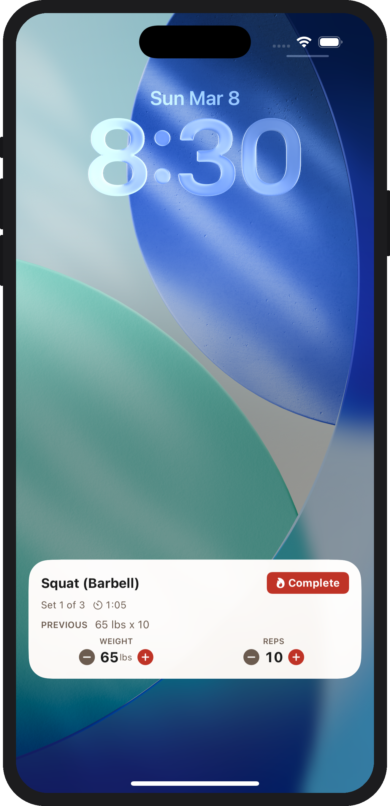
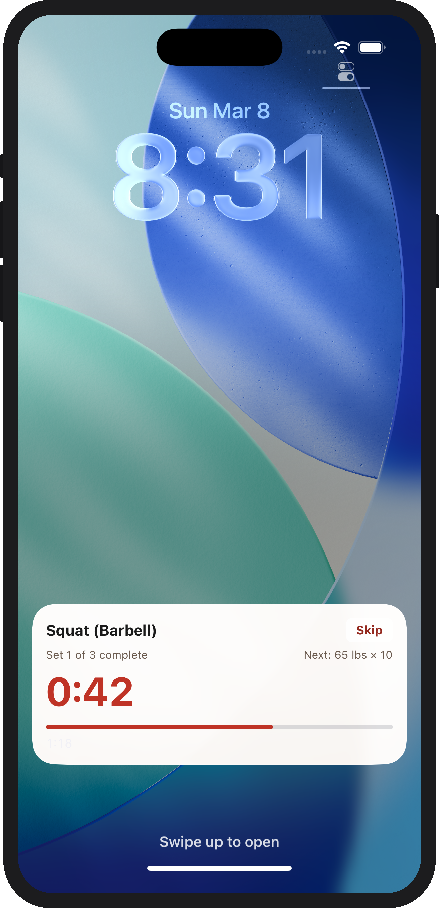
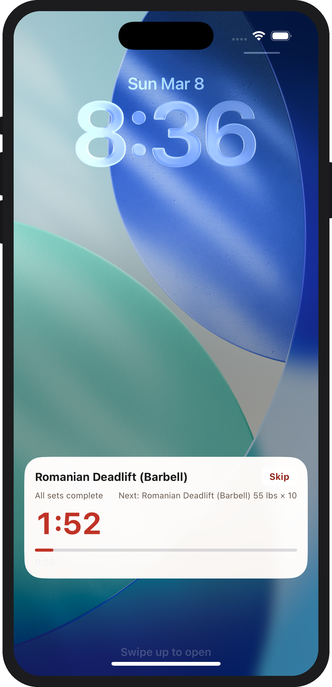
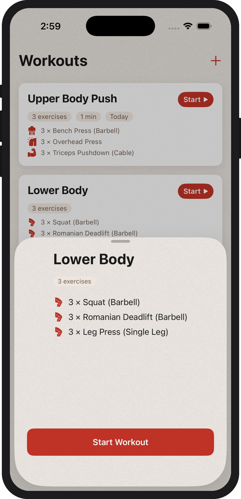
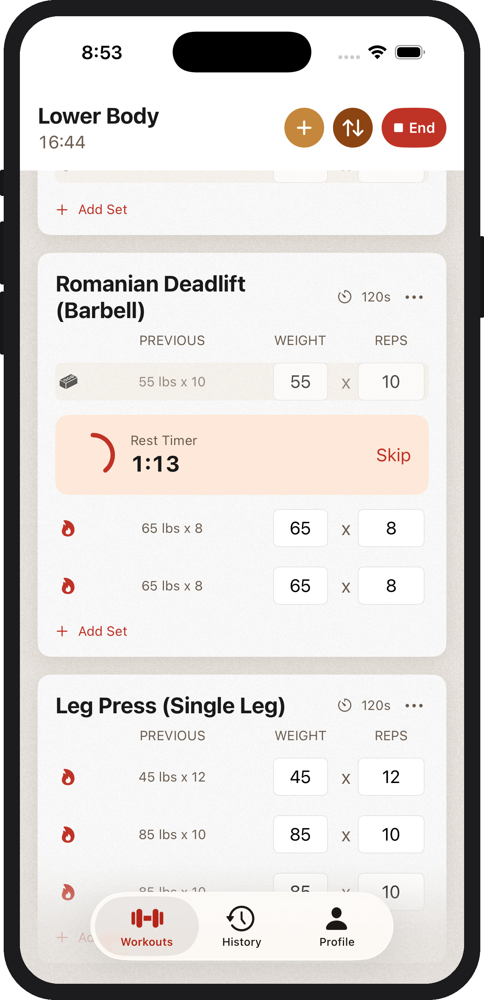
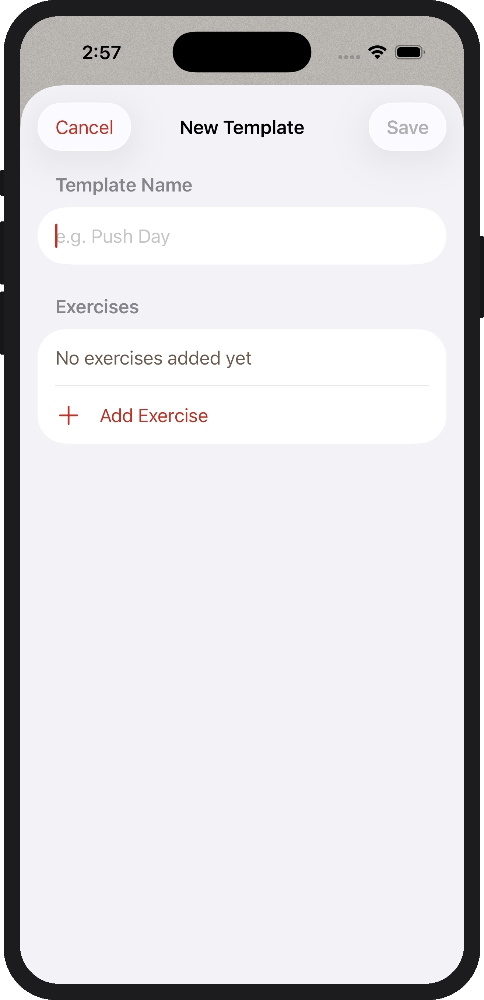
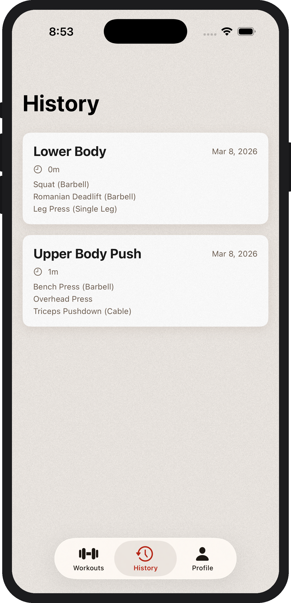
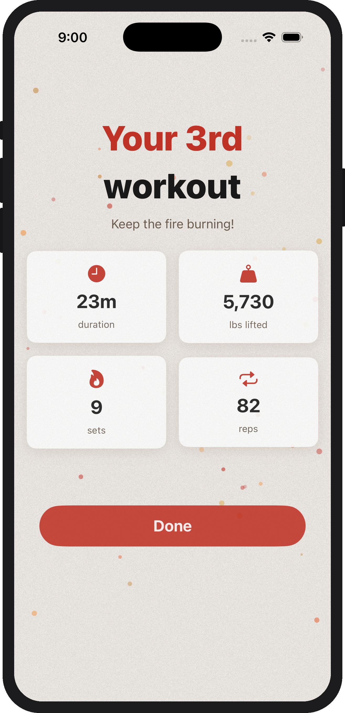
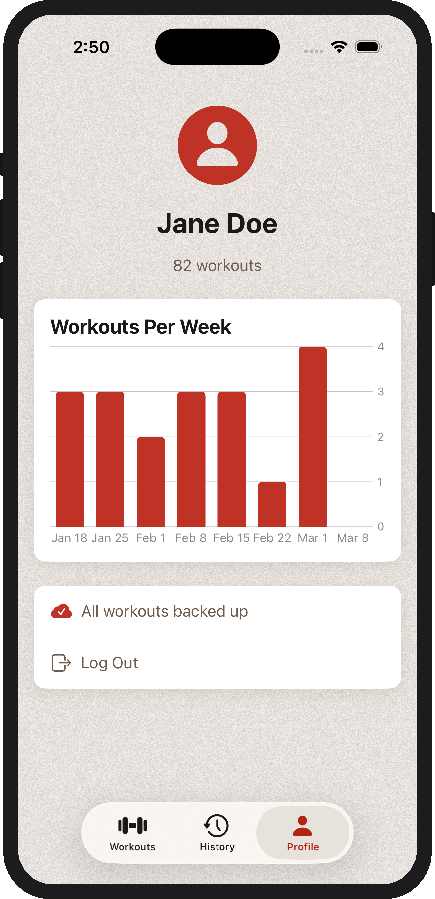

<p align="center">
  
</p>

Kiln is a personal workout tracker for iOS designed for self-hosting and sideloading.

## Complete your entire workout from the lock screen

No more opening your workout tracker every 2 minutes just to check a box.

<p align="center">
  
  
  
</p>

- Live Activity shows current exercise, set progress, and preview of the next set
- Adjust weight or reps directly on the lock screen
- Complete sets from the lock screen
- Get a push notification with sound when your rest timer is up (works even when app is killed)

## Create and start workouts easily

One tap to start a workout from a template.

<p align="center">
  
  
  
</p>

- See your last set within each workout
- View an in-line rest timer
- Add, swap, remove, and reorder exercises and sets mid-workout
- Crash-safe workout recovery — auto-resume with zero data loss
- Easily add new workouts and exercises, or edit existing ones

## Track your progress

See your full workout history and weekly trends at a glance.

<p align="center">
  
  
  
</p>

- Browse, edit, and delete past workouts
- Workouts-per-week chart on your profile
- Celebration screen when you finish a workout

## Built for self-hosting

- Python 3.12 / FastAPI / MongoDB backend, deployable on Coolify
- Per-user API keys stored in iOS Keychain
- Offline-tolerant — cached profile allows app use without the backend (rest timer notifications may be unreliable, though)
- Workout history syncs to the server (client-authoritative)

## Getting Started

Kiln is designed to be self-hosted & sideloaded onto your own iPhone. 

The backend is required for rest timer notifications & live activity state updates to fire reliably. It also serves as a backup for your workouts, in case of data loss or a new device, and allows for multiple users in your household.

### Prerequisites

- Xcode 16+ with iOS 17+ SDK
- A paid [Apple Developer account](https://developer.apple.com) (required for on-device builds and push notifications)
- [XcodeGen](https://github.com/yonaskolb/XcodeGen) (`brew install xcodegen`)
- A server for the backend, such as Coolify
  - Something like Vercel or Railway is completely fine, but the setup is very similar & I use Coolify currently
  - A MongoDB instance within your backend

### Apple Developer setup

1. Create a **Certificate Signing Request** (CSR) via Keychain Access → Certificate Assistant → Request a Certificate From a Certificate Authority. Save the `.certSigningRequest` file.
2. In the Apple Developer portal, go to Certificates, Identifiers & Profiles → Certificates → create a new **Apple Development** certificate using your CSR.
3. Create an **App ID** with the following capabilities:
   - App Groups (e.g. `group.com.yourname.kiln` — must match the `APP_GROUP` value in `project.yml`)
   - Push Notifications
4. Create an **APNS Key** (.p8 file) in Keys. Note the **Key ID**.
5. Note your **Team ID** (visible in Membership details).

### Deploy the backend

The backend is a FastAPI service in `timer-backend/`. It handles APNS push for Live Activity updates, user auth, and workout backups.

1. Base64-encode your `.p8` APNS key:
   ```bash
   base64 -i AuthKey_XXXXXXXXXX.p8
   ```
   Copy the output — you'll use it as `APNS_KEY_BASE64` below. This step helps get the .p8 file onto the server more easily.
2. Set up a MongoDB instance in your backend
3. Configure environment variables — copy `.env.example` to `.env`:
   ```
   APNS_KEY_ID=YOUR_KEY_ID
   APNS_TEAM_ID=YOUR_TEAM_ID
   APNS_KEY_BASE64=<paste your base64-encoded .p8 key here>
   APNS_ENVIRONMENT=development       # use "production" for App Store / TestFlight builds
   MONGODB_URL=YOUR_MONGODB_URL
   SEED_USER_NAMES=Alice,Bob          # comma-separated names for your household
   ```
4. Deploy with Coolify by pointing a new service at the `timer-backend/` directory in your GitHub repo and setting the environment variables in the dashboard.
5. Verify: `curl http://your-server:8000/health` should return `{"status":"ok"}`
6. On first launch, the backend creates an account for each name in `SEED_USER_NAMES` and prints their API keys to stdout in Coolify's Logs. Save these — each user enters their key on the iOS login screen.

### Build the iOS app

1. Copy `Secrets.xcconfig.example` to `Secrets.xcconfig` and set your backend URL:
   ```
   TIMER_BACKEND_URL = http://your-server:8000
   ```
2. Generate the Xcode project:
   ```bash
   xcodegen generate
   ```
3. Open `Kiln.xcodeproj` in Xcode
4. Update the bundle IDs in `project.yml` if you're using your own App ID (replace `app.izaro.kiln` with your own, e.g. `com.yourname.kiln`), then re-run `xcodegen generate`
5. Under Signing & Capabilities, select your Apple Developer team for both the `Kiln` and `KilnWidgets` targets
6. Ensure the Push Notifications and App Groups capabilities are present (XcodeGen configures these, but verify after signing)
7. Build and run on a physical device (Cmd+R) — Live Activities require a real device for full functionality
8. On first launch, enter your API key on the login screen

## Tech Stack

- **iOS**: Swift 5.9+ / SwiftUI / SwiftData / Swift Charts / ActivityKit / WidgetKit / AppIntents / iOS 17+
- **Backend**: Python 3.12 / FastAPI / MongoDB (motor) / httpx / PyJWT
- **Infra**: Coolify / Docker

## License

MIT — do whatever you want with it.